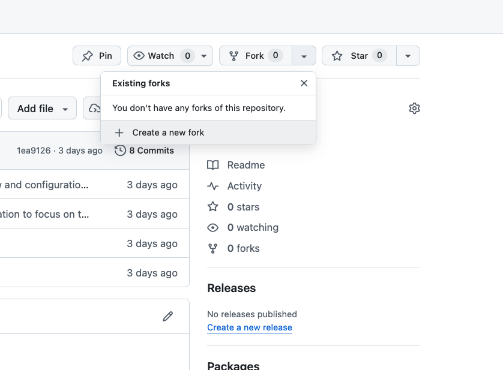
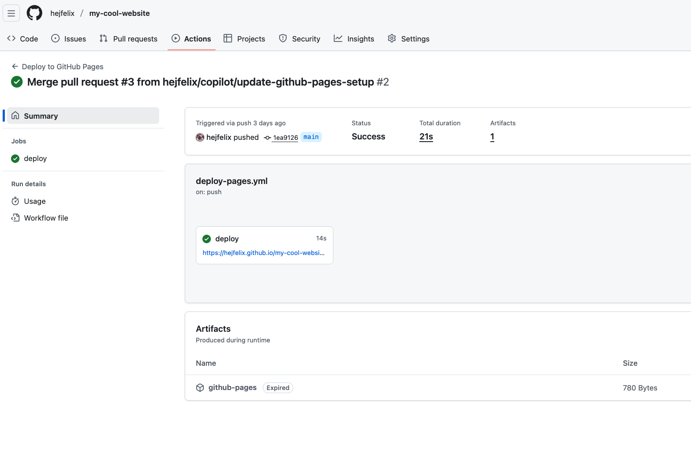

# **Setup Instructions**

1. Fork this repository
   1. 
2. Go to your **new** forked repository on GitHub: `https://github.com/<your-user-name>/my-cool-website`
3. Navigate to **Settings** → **Pages**
4. Under **Source**, select **GitHub Actions**

**That's it!** Your site will automatically deploy when you push changes to the `main` branch.

## Activity (AFTER cloning the repo)

> [!NOTE]
> Your goal is to create **your dream website**

1. Open your terminal, go to where you want to clone your repository
2. `git clone https://github.com/<your-user-name>/my-cool-website`
   1. alternatively, you can clone via ssh: `git clone git@github.com:<your-user-name>/my-cool-website.git`
3. Open your cloned repository with `vscode`
4. Implement your dream website using copilot in *agent mode*
5. Commit your changes to your `main` branch and push them
6. Go to your repository on github and click on `actions`. Look for the link to your new cool website with the changes you committed
   1. 
7. Show off your website by sharing your screen or sending the link in the chat :+1:
8. Profit?!

